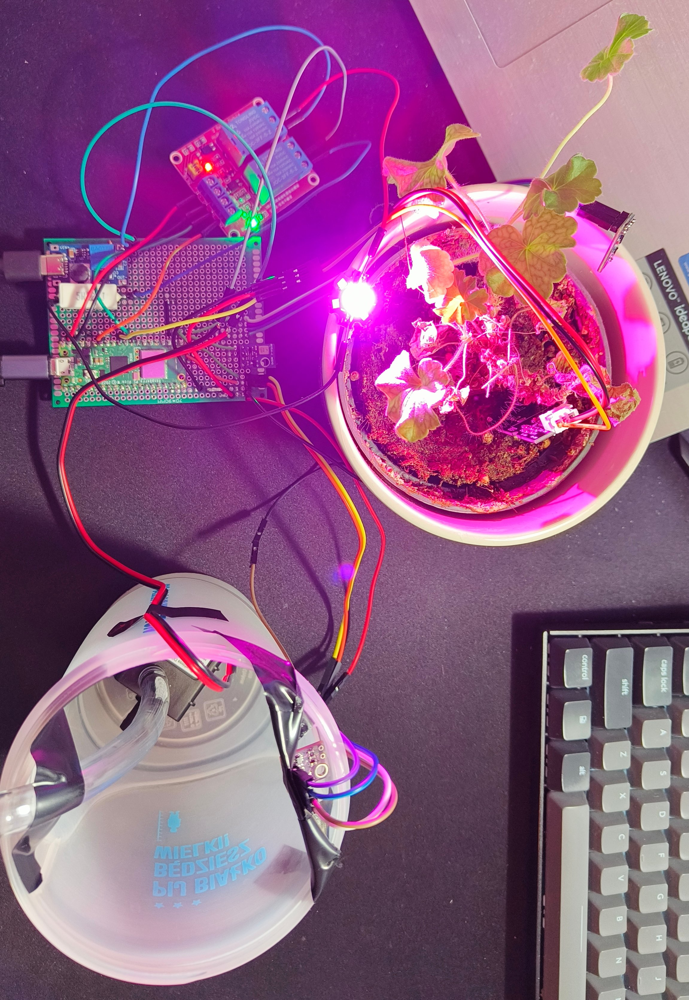
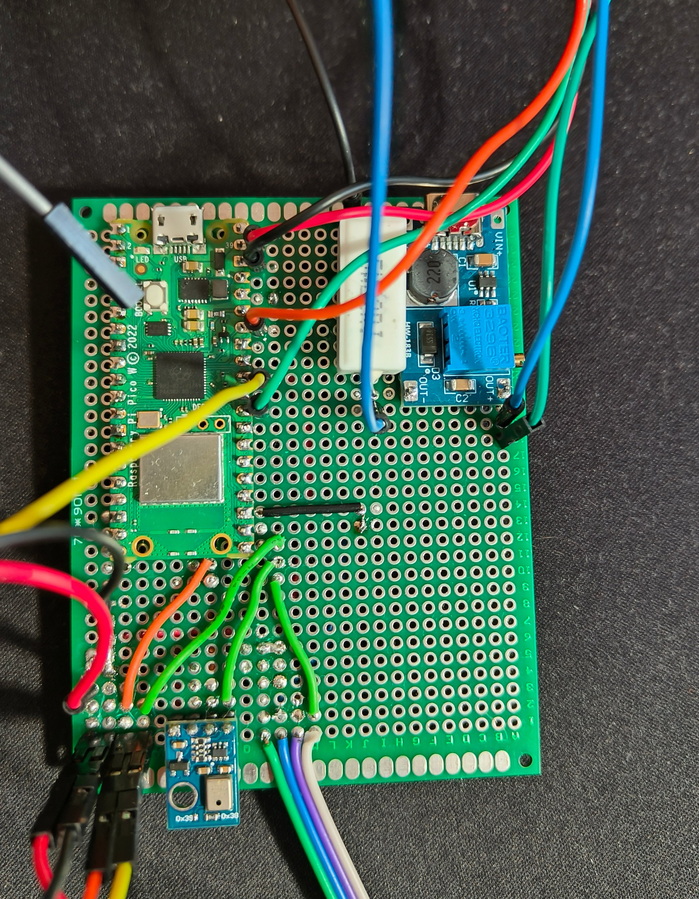

# Plant Monitoring System

This Plant Monitoring System is designed to automate plant care through real-time monitoring environment, watering and irradiating. It utilized several AWS services:

- **AWS IoT Core**: Used for gathering data and interacting with actuators remotely through MQTT topics.
- **AWS Relational Database**: Used for storing data from sensors and board in Postgres relational database.
- **AWS Lambda**: Used for passing data from MQTT topics directly to database.
- **AWS API Gateway**: Used for interacting with actuators and getting data from database using HTTP requests.

## System Architecture
[](img/system_srchotecture.svg)

Due to AWS management costs, account was closed and those functionalities currently does not work.

## Project Features

- **Real-Time Plant Monitoring**: Track soil moisture, temperature, ambient humidity, and light levels remotely to ensure that plant's environment is optimal.
- **Watering and Light exposure**: A water pump and diode can be operated through commands sent to proper MQTT topics.
- **Integration with AWS services**: AWS services allow to pass data from MQTT topics to database, interact with the board and retrieve historical data from database.

## Hardware Components

- **Raspberry Pi Pico W**: Acts as the central processing unit, connected directly to AWS IoT Core for sending data and receiving commands.
- **Actuators**:
  - **1W Full Spectrum Power Diode**: Provides supplemental lighting to the plant.
  - **Water Pump**: Automates watering through a 12V step-up converter for proper operation.
- **Sensors**:
  - **AHT10**: Monitors air temperature and humidity.
  - **BH1750**: Measures light intensity.
  - **VL53L0X**: Gauges the water level in the tank.
  - **Analog Soil Moisture Sensor**: Checks the soil's moisture.
- **2-Channel Relay**: Controls the diode and water pump.
- **Universal PCB Board**: All components are soldered for a compact and robust system.

## Project Pictures


    |  

## Remote Monitoring and Control through AWS IoT Core:
Remote connection and control could be executed through MQTT topics:

- **/environment-data**: Used for passing data from sensors.
- **/statistics**: Used for passing data about board (CPU and memory usage, board temperature, devices connected to I2C bus).
- **/pins-state**: Used for passing current data about used GPIOs.
- **/relay1-led**: Used for controlling 1st relay channel connected to power diode.
- **/relay2-pump**: Used for controlling 2st relay channel connected to water pump.
    - Example JSON payload to control relay (has to be published on /relay1-led or /relay2-pump topic):
      ```json
      // device_id is an id of RPi board obtained from ubinascii.hexlify(machine.unique_id()).decode()
      // operation accepts commands "on", "off" or "toggle"
      {
        "device_id": "<device_id>",
        "operation": "toggle"
      }
      ```
      
---

Project based on Raspberry Pi Pico W. Code written in MicroPython.
